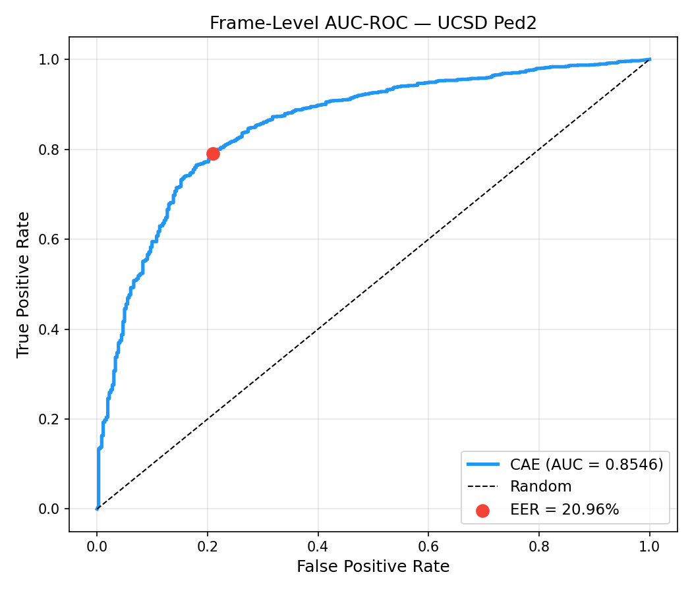
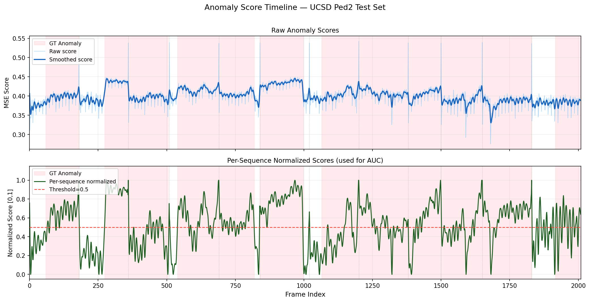
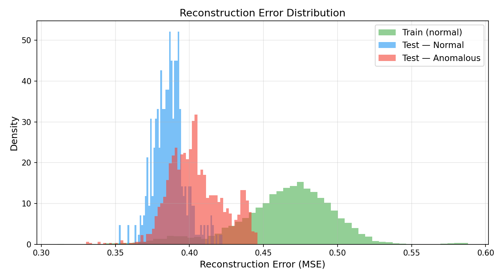

# Project V2.2 — Unsupervised Anomaly Detection in Surveillance Video


A fully unsupervised anomaly detection system for surveillance video. The model is trained **exclusively on normal frames** — no anomaly labels are used at any point. At inference, anomalous events are identified by high reconstruction error: the model reconstructs normal patterns well but fails on anything outside the learned normality distribution.

---

## Demo

| Normal Scene | Anomalous Event |
|:---:|:---:|
| Low score, cool heatmap | Heatmap lights up, score spikes red |

*Score graph strip at bottom: green = normal, red = anomaly. Red banner appears on detection.*

---

## How It Works

A **Convolutional Autoencoder (CAE)** is trained on normal pedestrian footage only. Each frame is passed through the encoder-decoder at inference — the per-pixel MSE between input and reconstruction is the anomaly score. Normal frames reconstruct accurately (low error); anomalous frames do not (high error).

**Optical flow** (Farnebäck) is concatenated as a second input channel, giving the model motion-awareness. Appearance anomalies and motion anomalies both contribute to the reconstruction error.

**Per-sequence score normalization** stretches each test sequence's score range to [0, 1] independently, making within-sequence anomaly spikes detectable even when absolute MSE values are similar across sequences.

```
Training frames (normal only)
        │
        ▼
┌───────────────────┐
│  Convolutional    │   grayscale + optical flow → encoder → bottleneck → decoder → reconstruction
│  Autoencoder      │
└───────────────────┘
        │
        ▼
  Reconstruction Error (per-pixel MSE)
        │
        ├── Frame-level score (mean MSE)
        │        │
        │        ├── Temporal smoothing (Gaussian)
        │        └── Per-sequence normalization → AUC-ROC evaluation
        │
        └── Pixel-level error map → JET heatmap overlay
```

---

## Results

| Metric | Value |
|---|---|
| **AUC-ROC (frame-level)** | **0.8546** |
| **EER** | **20.96%** |
| Dataset | UCSD Ped2 (test set) |
| Training data | UCSD Ped1 Train + Ped2 normal frames |
| Input channels | 2 (grayscale + Farnebäck optical flow) |
| Normalization | Per-sequence min-max |

### Evaluation Plots

| ROC Curve | Score Timeline | Error Distribution |
|:---:|:---:|:---:|
|  |  |  |

### Iteration History

| Run | Config | AUC-ROC |
|---|---|---|
| 1 | CAE, Ped1 train, global norm | 0.6150 |
| 2 | CAE, combined train, global norm | 0.6174 |
| 3 | CAE, combined train, per-seq norm | 0.7406 |
| 4 | **CAE + Flow, combined train, per-seq norm** | **0.8546** |

---

## Architecture

```
Input [B, 2, 256, 256]  (grayscale + flow)
│
├── Encoder
│   ├── EncoderBlock(2  → 16)   256×256 → 128×128
│   ├── EncoderBlock(16 → 32)   128×128 → 64×64
│   ├── EncoderBlock(32 → 64)   64×64   → 32×32
│   └── EncoderBlock(64 → 128)  32×32   → 16×16
│
├── Bottleneck Conv(128 → 128)  16×16
│
└── Decoder
    ├── DecoderBlock(128 → 64)  16×16  → 32×32
    ├── DecoderBlock(64  → 32)  32×32  → 64×64
    ├── DecoderBlock(32  → 16)  64×64  → 128×128
    └── DecoderBlock(16  → 2)   128×128 → 256×256  (Sigmoid)

Trainable parameters: ~500K
```

---

## Tech Stack

| Component | Tool |
|---|---|
| Framework | PyTorch |
| Optical Flow | OpenCV Farnebäck |
| Evaluation | scikit-learn |
| Visualization | OpenCV, Matplotlib |
| Dataset | UCSD Ped1 + Ped2 |
| Training | Google Colab T4 |
| Inference | Apple M1 (MPS) |
| Environment | conda |

---

## Project Structure

```
project-v2.2-anomaly-detection/
├── configs/
│   └── config.yaml                  # all parameters — no hardcoded values
├── models/
│   └── cae.py                       # Convolutional Autoencoder
├── scripts/
│   ├── preprocess.py                # dataset classes (single + dual channel)
│   ├── extract_frames.py            # .tif → .jpg frame extraction
│   ├── extract_ped2_normal.py       # extract normal frames from Ped2 test set
│   ├── extract_flow_maps.py         # pre-extract Farnebäck flow maps for training
│   ├── evaluate.py                  # AUC-ROC, EER, plots
│   └── inference_pipeline.py        # end-to-end inference + video export
├── utils/
│   ├── anomaly_score.py             # per-frame scoring pipeline
│   ├── flow_utils.py                # Farnebäck flow extraction utilities
│   ├── temporal_smoothing.py        # Gaussian score smoothing
│   └── visualization.py             # heatmap, mask, score strip, composite frame
├── notebooks/
│   └── train_anomaly.ipynb          # Colab T4 training notebook
├── data/                            # gitignored — download separately
├── outputs/                         # gitignored — generated at runtime
├── environment.yml
└── README.md
```

---

## Setup

### 1. Clone & create environment

```bash
git clone https://github.com/tajwarchy/project-v2.2-anomaly-detection.git
cd project-v2.2-anomaly-detection
conda env create -f environment.yml
conda activate anomaly-det
```

### 2. Download dataset

Download from [UCSD Anomaly Detection Dataset](http://www.svcl.ucsd.edu/projects/anomaly/dataset.htm):

```
UCSDped1/Train/  →  data/ucsd_ped1/training/
UCSDped2/Test/   →  data/ucsd_ped2/testing/
```

Then extract frames:

```bash
python scripts/extract_frames.py
python scripts/extract_ped2_normal.py
```

### 3. Pre-extract flow maps

```bash
# Build combined training set (Ped1 + Ped2 normal)
mkdir -p data/combined_normal/frames
cp -r data/ucsd_ped1/training/frames/* data/combined_normal/frames/
for seq in data/ucsd_ped2/training/frames/*/; do
    cp -r "$seq" "data/combined_normal/frames/P2_$(basename $seq)"
done

# Extract flow maps
python scripts/extract_flow_maps.py
```

### 4. Train on Google Colab

Open `notebooks/train_anomaly.ipynb` in Colab with a T4 GPU runtime. Upload training frames and flow maps to Google Drive. Run all cells. Download `best_model_flow.pth` to `outputs/checkpoints/`.

### 5. Run inference

```bash
# Full test set
python scripts/inference_pipeline.py

# Single sequence
python scripts/inference_pipeline.py \
    --source data/ucsd_ped2/testing/frames/Test001
```

### 6. Evaluate

```bash
python -m utils.anomaly_score
python -m scripts.evaluate
```

---

## Output Files

| File | Description |
|---|---|
| `outputs/annotated_video/output_annotated.mp4` | Full annotated video |
| `outputs/flagged_clips/clip_00X.mp4` | Auto-extracted anomalous clips |
| `outputs/roc_curve.png` | AUC-ROC curve |
| `outputs/score_timeline.png` | Raw + smoothed + normalized score timeline |
| `outputs/error_distribution.png` | Reconstruction error distribution |
| `outputs/eval_summary.txt` | Evaluation summary |

---

## Hardware Notes

Training on M1 CPU for 50+ epochs over 7K frames is too slow to be practical (~8+ hours). Google Colab T4 reduces this to ~2 hours. All inference runs on M1 MPS at ~130 frames/second for scoring and ~30 FPS for rendering.

`num_workers=0` is set throughout for macOS multiprocessing stability. Inference resolution is kept at 256×256 for real-time speed on M1.

---

## Key Design Decisions

**Why unsupervised?** Anomaly labels are expensive and rare in real surveillance deployments. Training on normal data only is the practical approach — any deployment site just needs a few hours of normal footage.

**Why per-sequence normalization?** Absolute MSE values are similar across all UCSD Ped2 test frames due to visual consistency. Global normalization compresses discriminative signal. Per-sequence normalization stretches each sequence's score range independently, making local anomaly spikes visible and boosting AUC from 0.617 to 0.855.

**Why Farnebäck over RAFT?** Farnebäck runs on CPU with no model weights, making it fast and portable. For this dataset the motion patterns are simple enough that dense classical flow captures the necessary signal without the complexity of a learned flow model.

---

## License

MIT
